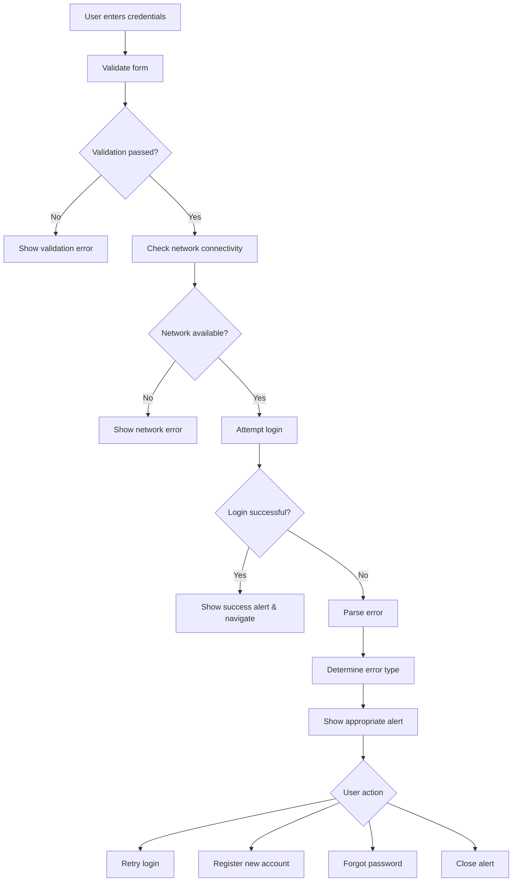

# Enhanced Login Error Handling

## Overview

This document describes the comprehensive error handling improvements made to the mobile app login screen. The enhancements provide better user experience, clearer error messages, and more robust error handling for various scenarios.

## Features Implemented

### 1. Network Connectivity Monitoring

**Location**: `src/screens/LoginScreen.tsx`

- **Real-time network status detection** using `@react-native-community/netinfo`
- **Visual network warning banner** when offline
- **Login button disabled** when no internet connection
- **Automatic network state updates** with event listeners

```typescript
// Network connectivity state
const [isConnected, setIsConnected] = useState(true);

// Check network connectivity on mount
useEffect(() => {
  const checkConnectivity = async () => {
    try {
      const state = await NetInfo.fetch();
      setIsConnected(state.isConnected ?? true);
    } catch (error) {
      console.log('Network check failed:', error);
      setIsConnected(true); // Assume connected if check fails
    }
  };

  checkConnectivity();

  // Listen for network changes
  const unsubscribe = NetInfo.addEventListener((state: any) => {
    setIsConnected(state.isConnected ?? true);
  });

  return () => unsubscribe();
}, []);
```

### 2. Enhanced Form Validation

**Location**: `src/screens/LoginScreen.tsx` - `validateForm()` function

- **Comprehensive validation** for email and password fields
- **Real-time error clearing** when user starts typing
- **Specific error messages** for different validation failures
- **Network connectivity check** before form submission

```typescript
const validateForm = () => {
  // Clear previous errors
  setError("");
  setShowLoginAlert(false);

  // Check network connectivity first
  if (!isConnected) {
    setError("Tidak ada koneksi internet. Periksa koneksi Anda dan coba lagi.");
    return false;
  }

  // Email validation
  if (!email.trim()) {
    setError("Email tidak boleh kosong");
    return false;
  }

  if (!isValidEmail(email)) {
    setError("Format email tidak valid. Contoh: user@example.com");
    return false;
  }

  // Password validation
  if (!password.trim()) {
    setError("Password tidak boleh kosong");
    return false;
  }

  if (password.length < 6) {
    setError("Password minimal 6 karakter");
    return false;
  }

  return true;
};
```

### 3. Error Categorization and Styling

**Location**: `src/components/LoginErrorDisplay.tsx`

- **Color-coded error types** for better visual distinction
- **Context-aware error titles** based on error content
- **Smart retry button display** (hidden for non-retryable errors)
- **Enhanced visual styling** with shadows and better spacing

#### Error Categories:

| Error Type | Color | Icon | Description |
|------------|-------|------|-------------|
| Credential Errors | Orange (#F59E0B) | account-alert | Wrong email/password |
| Network Errors | Blue (#3B82F6) | wifi-off | Connection issues |
| Rate Limit Errors | Red (#EF4444) | clock-alert | Too many attempts |
| Account Deactivated | Purple (#8B5CF6) | account-lock | Account disabled |
| Timeout Errors | Orange (#F97316) | timer-sand | Request timeout |
| Server Errors | Dark Red (#DC2626) | server-off | Server issues |
| Validation Errors | Green (#059669) | alert-circle | Format issues |

### 4. Enhanced Alert System

**Location**: `src/components/LoginAlert.tsx`

- **Smart button display** based on error context
- **Context-aware actions** (register, forgot password, retry)
- **Improved visual design** with better spacing and icons
- **Animated transitions** for better UX

```typescript
const shouldShowRegister = () => {
  const messageLower = message.toLowerCase();
  return messageLower.includes('tidak terdaftar') || 
         messageLower.includes('daftar') ||
         messageLower.includes('register');
};

const shouldShowForgotPassword = () => {
  const messageLower = message.toLowerCase();
  return messageLower.includes('password') || 
         messageLower.includes('kredensial') ||
         messageLower.includes('salah');
};
```

### 5. Comprehensive Error Handling

**Location**: `src/screens/LoginScreen.tsx` - `handleLogin()` function

- **Enhanced error parsing** using both `parseError` and `parseAuthError`
- **Specific error handling** for different error types
- **User-friendly error messages** in Indonesian
- **Appropriate alert types** (error, warning, info)

```typescript
// Enhanced error parsing and handling
const errorInfo = parseError(error);
const authErrorInfo = parseAuthError(error);

let finalMessage = authErrorInfo.userMessage;
let finalType: 'error' | 'warning' | 'info' = 'error';

// Handle specific error cases
if (errorInfo.type === 'NETWORK') {
  finalMessage = "Koneksi internet terputus. Periksa koneksi Anda dan coba lagi.";
  finalType = 'warning';
} else if (errorInfo.type === 'TIMEOUT') {
  finalMessage = "Koneksi timeout. Silakan coba lagi.";
  finalType = 'warning';
} else if (errorInfo.type === 'SERVER') {
  finalMessage = "Server sedang mengalami gangguan. Silakan coba lagi dalam beberapa menit.";
  finalType = 'warning';
} else if (errorInfo.type === 'RATE_LIMIT') {
  finalMessage = "Terlalu banyak percobaan login. Silakan tunggu beberapa menit sebelum mencoba lagi.";
  finalType = 'warning';
}
```

### 6. User Experience Improvements

- **Loading states** during login process
- **Disabled inputs** during loading to prevent multiple submissions
- **Success alerts** with proper navigation
- **Retry functionality** with appropriate delays
- **Real-time error clearing** on input
- **Better accessibility** with proper button states

## Error Handling Flow



## Error Messages

### Validation Errors
- **Empty email**: "Email tidak boleh kosong"
- **Invalid email format**: "Format email tidak valid. Contoh: user@example.com"
- **Empty password**: "Password tidak boleh kosong"
- **Short password**: "Password minimal 6 karakter"

### Network Errors
- **No connection**: "Tidak ada koneksi internet. Periksa koneksi Anda dan coba lagi."
- **Connection lost**: "Koneksi internet terputus. Periksa koneksi Anda dan coba lagi."
- **Timeout**: "Koneksi timeout. Silakan coba lagi."

### Authentication Errors
- **Wrong credentials**: "Email atau password salah. Silakan periksa kembali kredensial Anda."
- **Email not found**: "Email tidak terdaftar. Silakan daftar terlebih dahulu atau periksa kembali email Anda."
- **Wrong password**: "Password salah. Silakan periksa kembali password Anda."
- **Account deactivated**: "Akun Anda telah dinonaktifkan. Hubungi admin untuk bantuan lebih lanjut."

### Server Errors
- **Server error**: "Server sedang mengalami gangguan. Silakan coba lagi dalam beberapa menit."
- **Rate limit**: "Terlalu banyak percobaan login. Silakan tunggu beberapa menit sebelum mencoba lagi."

## Technical Implementation

### Dependencies Used
- `@react-native-community/netinfo` - Network connectivity monitoring
- `react-native-paper` - UI components
- `react-native-vector-icons` - Icons
- Custom error handling utilities

### Key Components
1. **LoginScreen.tsx** - Main login screen with enhanced error handling
2. **LoginErrorDisplay.tsx** - Error display component with categorization
3. **LoginAlert.tsx** - Alert component with smart actions
4. **alertUtils.ts** - Consistent alert styling utilities
5. **errorHandler.ts** - General error handling utilities
6. **authErrorHandler.ts** - Authentication-specific error handling

### State Management
```typescript
// Error states
const [error, setError] = useState("");
const [showLoginAlert, setShowLoginAlert] = useState(false);
const [alertMessage, setAlertMessage] = useState("");
const [alertType, setAlertType] = useState<'error' | 'warning' | 'info'>('error');

// Loading states
const [isLoading, setIsLoading] = useState(false);
const [socialLoading, setSocialLoading] = useState(false);

// Network state
const [isConnected, setIsConnected] = useState(true);
```

## Testing

A comprehensive test script has been created at `scripts/test-login-error-handling.js` that verifies all error handling scenarios.

To run the tests:
```bash
node scripts/test-login-error-handling.js
```

## Benefits

1. **Better User Experience**: Clear, actionable error messages
2. **Reduced Support Tickets**: Self-explanatory error handling
3. **Improved Accessibility**: Proper button states and screen reader support
4. **Consistent Design**: Unified error handling across the app
5. **Robust Error Recovery**: Smart retry mechanisms and fallback options
6. **Network Awareness**: Real-time connectivity monitoring
7. **Localized Messages**: All error messages in Indonesian

## Future Enhancements

1. **Offline Mode**: Cache login attempts for when connection is restored
2. **Biometric Authentication**: Add fingerprint/face ID support
3. **Progressive Web App**: Enhanced offline capabilities
4. **Analytics Integration**: Track error patterns for improvement
5. **A/B Testing**: Test different error message variations

## Conclusion

The enhanced login error handling provides a significantly improved user experience with comprehensive error coverage, clear messaging, and robust recovery mechanisms. The implementation follows React Native best practices and maintains consistency with the existing codebase architecture.
